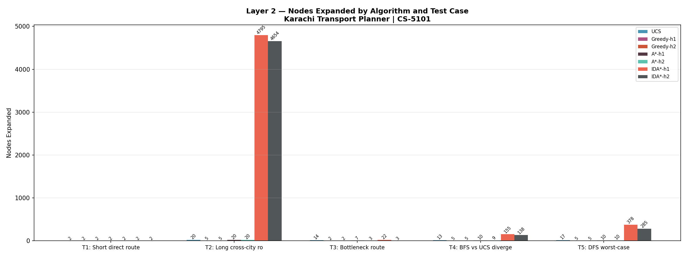
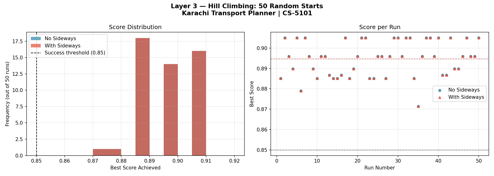
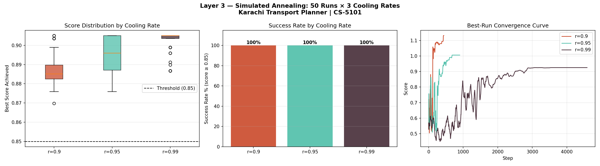
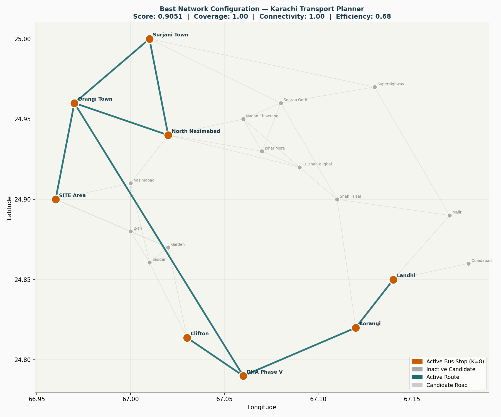

# CS-5101 — Karachi Transport Planner
## MS AI Evening Program | Spring 2026 | Assignment 1 & 2

---

## Project Structure

```
karachi_transport/
├── graph_data.py          # Node list, coordinates, edge list (raw data)
├── graph.py               # KarachiGraph class (adjacency list, helpers)
├── layer1_uninformed.py   # Layer 1: BFS, DFS, UCS — common interface
├── layer1_tests.py        # Layer 1: 5 test cases, results table, analysis
├── layer2_heuristic.py    # Layer 2: Greedy, A*, IDA* (added in Layer 2)
├── layer2_tests.py        # Layer 2: comparison vs UCS, charts
├── layer3_optimization.py # Layer 3: Hill Climbing, RRHC, SA
├── layer3_tests.py        # Layer 3: experiments (50 runs, cooling schedules)
└── README.md              # This file
```

---

## How to Run

### Prerequisites
```bash
pip install matplotlib  # only needed for chart output in layers 2 & 3
```

No other external packages required. Python 3.10+.

### Layer 1 — Uninformed Search
```bash
cd karachi_transport
python layer1_tests.py
```
Outputs:
- Graph summary (nodes, edges, bottlenecks)
- Results table for all 5 test cases × 3 algorithms
- ASCII bar chart of nodes expanded
- Written analysis

### Layer 2 — Heuristic Search *(added after Layer 1)*
```bash
python layer2_tests.py
```

### Layer 3 — Network Optimization *(added after Layer 2)*
```bash
python layer3_tests.py
```

---

## Graph Quick Reference

| Metric         | Value |
|----------------|-------|
| Nodes          | 20    |
| Edges          | 37    |
| Min edge weight| 10 min (Saddar–Garden, Garden–Lyari, Johar–Nagan) |
| Max edge weight| 65 min (Orangi Town–DHA Phase V — bottleneck) |

### Bottleneck Edges
| Edge                              | Weight | Reason                              |
|-----------------------------------|--------|-------------------------------------|
| Orangi Town ↔ DHA Phase V         | 65 min | No direct bridge; Lyari Exp detour  |
| DHA Phase V ↔ Korangi             | 25 min | Korangi Creek Bridge; single point  |
| North Nazimabad ↔ Orangi Town     | 30 min | Orangi nullah crossing              |

---

## Algorithm Interface (Layer 1)

All three algorithms share an identical signature:

```python
from graph import KarachiGraph
from layer1_uninformed import bfs, dfs, ucs, search

g = KarachiGraph()

result = bfs(g, "Saddar", "Gulshan-e-Iqbal")
result = dfs(g, "Saddar", "Gulshan-e-Iqbal")
result = ucs(g, "Saddar", "Gulshan-e-Iqbal")

# Or use the dispatcher:
result = search(g, "Saddar", "Gulshan-e-Iqbal", algorithm="ucs")

print(result)
# Fields: result.path, result.cost, result.nodes_expanded, result.max_frontier, result.found
```

---

## Test Cases (Layer 1)

| # | Route                         | Purpose                                      |
|---|-------------------------------|----------------------------------------------|
| 1 | Saddar → Garden               | Short direct (1 hop, 10 min)                 |
| 2 | Orangi Town → Quaidabad       | Long cross-city (many hops)                  |
| 3 | Orangi Town → DHA Phase V     | Bottleneck: direct=65min vs multi-hop detour |
| 4 | Saddar → Gulshan-e-Iqbal      | BFS and UCS find different paths             |
| 5 | Clifton → Surjani Town        | DFS dives south/east before finding north    |

---

## Output Charts

Generated automatically when running the test scripts:

| File | Generated By | Description |
|------|-------------|-------------|
| `layer2_chart.png` | `layer2_tests.py` | Nodes expanded per algorithm × test case (bar chart) |
| `layer3_hc_chart.png` | `layer3_tests.py` | Hill Climbing score distribution — no sideways vs sideways, 50 runs |
| `layer3_sa_chart.png` | `layer3_tests.py` | SA performance across 3 cooling rates (r=0.90, 0.95, 0.99) |
| `layer3_best_network.png` | `layer3_tests.py` | Best bus network found — active stops and routes on Karachi map |

### Layer 2 — Nodes Expanded by Algorithm


### Layer 3 — Hill Climbing: 50 Random Starts


### Layer 3 — Simulated Annealing: Cooling Rate Comparison


### Layer 3 — Best Network Configuration Found


---

## Reports

| File | Contents |
|------|----------|
| `PartA_Karachi_Transport_Planner.pdf` | Problem analysis — PEAS, environment classification, graph design, formal problem formulation |
| `PartB_Karachi_Transport_Planner.pdf` | Implementation report — Layer 1/2/3 results, analysis, KMC recommendation |

---

## Assignment Structure Mapping

| Assignment Component | File(s)                                   |
|----------------------|-------------------------------------------|
| Part A (analysis)    | Report PDF (separate)                     |
| Layer 1              | layer1_uninformed.py + layer1_tests.py    |
| Layer 2              | layer2_heuristic.py + layer2_tests.py     |
| Layer 3              | layer3_optimization.py + layer3_tests.py  |
| Graph Data           | graph_data.py (importable as JSON/CSV too)|
